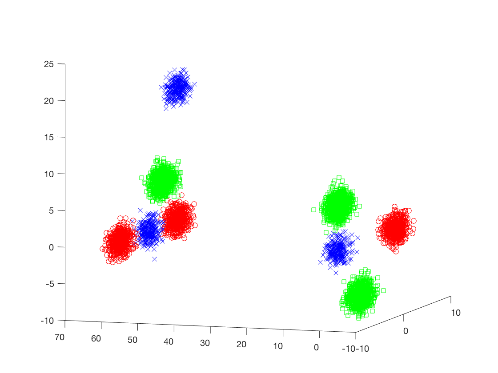
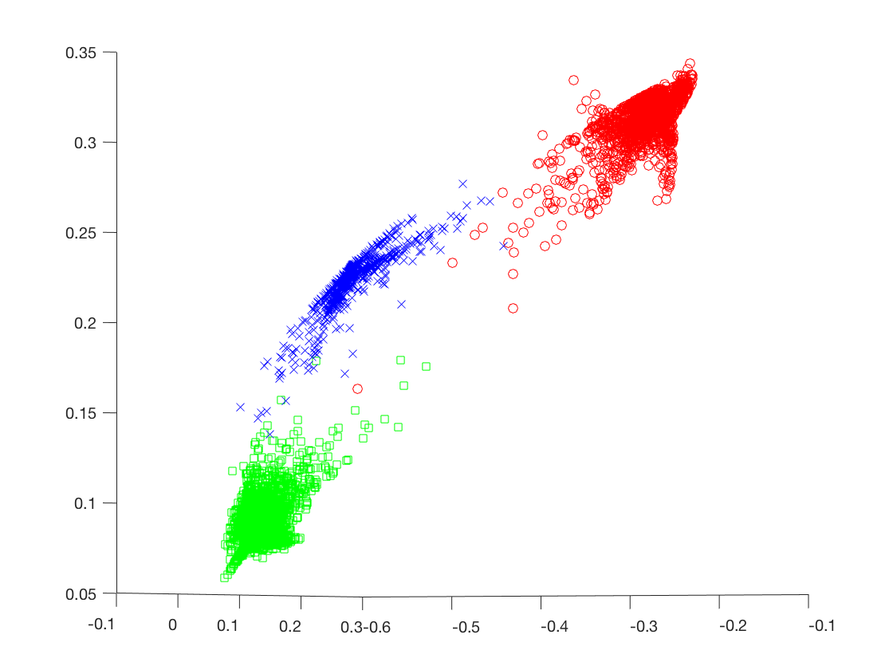

# Deep Spectral Clustering Learning

This is a PyTorch 0.4.0 version of our <a href="http://proceedings.mlr.press/v70/law17a.html">Deep Spectral Clustering paper</a>.
Matlab scripts are provided for visualization purpose.

## Running the code

Each script can be run independently since the required dataset files are provided. 

Otherwise, you can run the scripts in the following order:

### Generation of the training and test datasets

The matlab script generate_datasets.m generates some toy dataset which is not linearly separable. It saves the training and test datasets in the files X_train.txt and X_test.txt and creates the corresponding assignment matrices Y_train.txt and Y_test.txt. The training dataset contains 15000 examples and the test set contains 6000 examples.
The script also plots the generated training and test datasets (in a single figure).

### Preprocessing of the .txt datasets as .npy files

The python script transform_files.py transforms the datasets in numpy files (extension .npy) so that they are faster to load. Simply run the command 

```python transform_files.py```

### Training and testing the model

The pytorch code train_and_test_model.py learns a small neural network using the generated training dataset. 
Run the command 

```python train_and_test_model.py```

Once training is over, it saves the representations of the test dataset in 3 files: one which contains the original representations (used as input of the model), one which contains the output representations of the neural network, and one which contains the labels.
In the toy experiment, a small multi-layer perceptron with only 2 hidden layers is learned because the dataset is simple. More complicated datasets require models with more units, more hidden layers and maybe other types of activation functions.

### Visualization of test representations

The matlab script plot_test_data.m plots the learned representations of the test set (i.e., output of the neural network) when spectral clustering is applied as described in the paper. 
The plotted figure should look like the following image:

<p align="center"></p>

If the variable plot_output is set to false, it plots the original test dataset which is not linearly separable and looks like the following image:

<p align="center"></p>
 
If the variable use_singular_vectors is set to false, it will plot the output of the neural network without processing spectral clustering.

<p align="center"></p>
 
## Nota Bene

The output dimensionality of the learned neural network in this toy experiment is 3 because the dataset contains only 3 categories.
For other datasets where the number of categories k is higher, the output dimensionality of the learned model has to be k.

 
